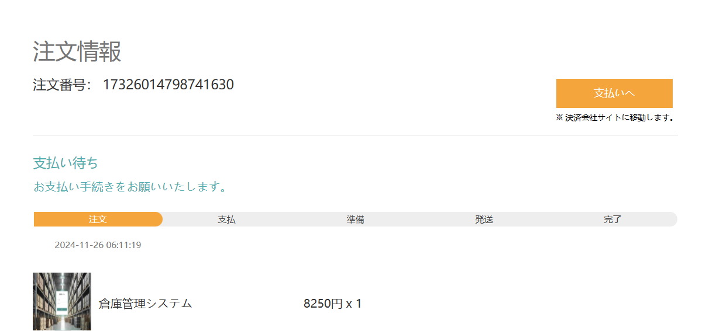
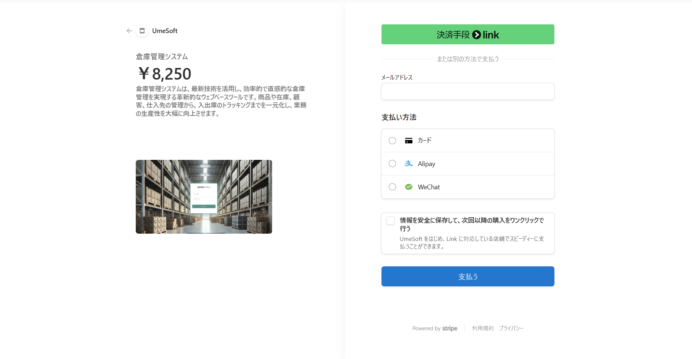
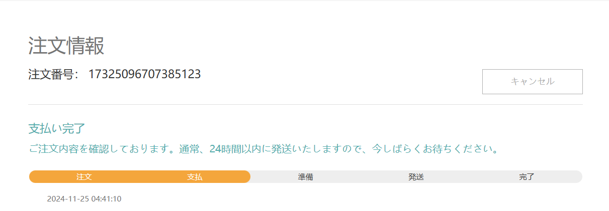

# Stripe導入手順

## 概要

Stripe Checkoutを利用することで、オンライン決済を簡単かつ安全に実装できます。

本手順書では、基本的な実装フローを順序立てて説明します。

## 導入効果

Stripeを導入することで、以下の効果が得られます：

- 簡単な操作で支払い画面に遷移
  
  ユーザーが注文画面で「支払い」ボタンを押すと、Stripeが提供する支払い画面に移動します。

- 多様な支払い方法に対応
  
  支払い画面には、クレジットカード、デビットカード、銀行振込、ApplePay、GooglePay、コンビニ決済などのオプションが表示されます。

- 支払い後のスムーズなリダイレクト
  
  支払い完了後、自動的に注文画面に戻り、注文処理が続行されます。

- 自動返金
  
  注文キャンセルされた場合、自動的に返金が行われます。
  
  

以下の画像を確認して、導入効果をご確認ください。

支払いボタン押下

支払い画面へ遷移

支払い完了後、注文画面に遷移し、支払いステータスが更新される

##### 

## 開発情報

- サーバーサイド:  Java

- フロントエンド:  HTML/JavaScript

#### 

## 前提

Stripeを利用するために必要な準備：

### Stripeアカウントの登録

- Stripeアカウントを作成（無料、初期費用・月額費不要）。

- アカウント作成後、Stripe Dashboardで「開発者メニュー」から「APIキー」を取得。

　　※「公開可能キー（フロントエンド用）」と「シークレットキー（サーバー用）」の2種類が提供されます。

### StripeのSDKをインストール

Stripeが提供するサーバー用SDKを以下の公式サイトからインストールします：[Stripe SDK](https://docs.stripe.com/sdks)

### 開発環境の準備

EclipseやIntelliJ IDEAなどの開発環境を用意します。

##### 

## 導入手順

### Stripe で商品を追加する

- Stripe Dashboardで商品を登録します。

- 登録後、各商品に対応する「priceID」が生成されるので、これを保存しておきます。

### Stripe でWebhookを設定する

StripeのWebhookは、Stripeがシステム内で特定のイベント（支払い完了、返金処理、サブスクリプション更新など）を検知した際に、事前に指定されたURL（Webhookエンドポイント）にリアルタイムで通知を送信する仕組みです。

この通知により、ユーザー側のシステムはStripeのイベントに基づいた処理（例: 注文ステータスの更新やメール送信）を自動で実行できます。
##### ※詳細手順は【別紙】Webhook設定シート参照。

### フロントエンドの実装

- 支払いボタンの実装

　　支払いボタン押下時に以下の情報をバックエンドに送信します：

　　　**APIキー:** ショップを識別するために使用。　

　　　**商品ID:** 支払い対象の商品を特定（複数可）。

　　　**数量:** Stripeが支払い総額を計算するために使用。

　　　**注文番号:** 支払い成功後に注文状態を更新するために利用。

- バックエンドからのリンク受け取り

　　バックエンドで生成した支払いリンクを受け取り、新規タブで表示します。

- キャンセルボタンの実装
  
  キャンセルボタン押下時に注文番号をバックエンドに送信します。

### バックエンドの実装

- 支払い画面の生成
  
  フロントエンドから受け取った情報をもとに、Stripeライブラリを使用して支払い画面のリンクを生成します。
  
  支払い成功時・失敗時のリダイレクト先を設定します。

- Webhookを利用した注文状態の更新
  
  StripeのWebhookを利用して、サーバーが支払い状況（成功、失敗、期限切れなど）を受信します。
  
  Webhookのデータをもとに注文番号を特定し、該当注文の状態を更新します。

- 返金処理
  
  Stripeの返金プロセスを構築することで、Stripeが自動返金を行われます。

## テスト

### 支払い画面生成の確認

- 支払いボタンを押して、正しく支払い画面に遷移するか確認します。

- また、Stripeが提供するテスト用カード番号（例: 4242 4242 4242 4242）を使用して、支払いフローの動作をテストします。

### Webhookのテスト

ローカル環境ではWebhookサービスを直接利用できないため、以下の手順で代替テストを行います。

##### ※【別紙】Webhookテストシート参照。

### 返金処理の確認

キャンセルボタンを押して、正しく返金が行われることを確認します。

##### ※本手順書は概要レベルの内容です。詳細なフル手順書をご希望の方は、[こちら](https://www.umesoft.jp/goods/detail/2)からご購入いただけます。ご購入後、すべてのソースコードおよびフル手順書(Excel形式)をお送りいたします。
